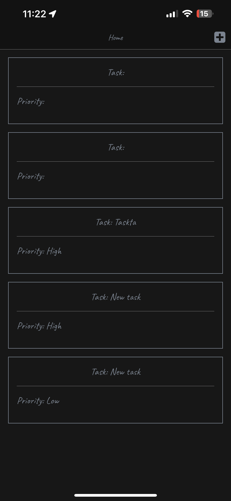
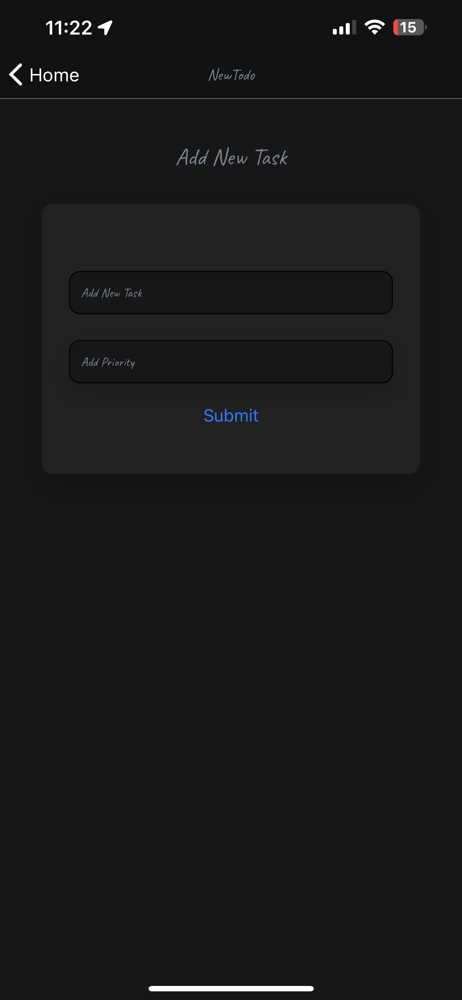

# Task Force: Task Management Application

Task Force is a powerful task management application built using React Native. It provides a simple and intuitive interface for managing your daily tasks efficiently. With Task Force, you can create, edit, and mark tasks as complete with ease. This README will guide you through the installation process and provide an overview of the application's features.

## User Stories

- **User Story 1: Create a new todo item**

  - As a user, I want to be able to create a new todo item.
  - **Acceptance Criteria:**
    - [x] The user should be able to enter a title for the todo item.
    - [x] The user should be able to specify a priority for the todo item.

- **User Story 2: Edit a todo item**

  - As a user, I want to be able to edit a todo item.
  - **Acceptance Criteria:**
    - [x] The user should be able to change the title of the todo item.
    - [ ] The user should be able to change the description of the todo item.

- **User Story 3: Mark a todo item as complete**
  - As a user, I want to be able to mark a todo item as complete.
  - **Acceptance Criteria:**
    - [x] The user should be able to mark a todo item as complete.
    - [x] The user should be able to unmark a todo item as complete.
    - [x] The user should be able to delete the task.

## Mockup

## Screenshots

## UML Diagram

## Milestones

- **Milestone 1 - MVP (This Lab)**

  - Deliver your Minimum Viable Product (MVP) with basic functionality.
  - Ensure your development environment is properly set up.
  - Other users should be able to scan your QR code and access your app on any device.
  - All core features should be implemented and working correctly.
  - Styling is not a priority for this milestone. Focus on functionality and core features.

- **Milestone 2 - Product Delivery (This Lab)**
  - Once your MVP is complete, shift your focus to enhancing the user experience.
  - Implement quality and thoughtful styling using CSS-in-JS.
  - Optimize tap targets for better usability and ensure good contrast.
  - Provide support for both Dark and Light modes.
  - Design a well-thought-through user experience.
  - Consider the needs of users who primarily use their thumbs or have different hand preferences.

## How to Install the Application

To install and run the Task Force application on your device, follow these steps:

1. Clone the repository to your local machine.
2. Set up an account at [expo.io](https://expo.io).
3. Download the Expo Go application on your mobile device.
4. Navigate to the project directory and run `npm install` to install the dependencies.
5. Run the command `npx expo start --tunnel` to start the development server.
6. Scan the QR code using the Expo Go app on your device to launch the application.

## Resources

- [React Navigation](https://reactnavigation.org/): React Navigation is a library that manages screens, navigation, and history in a React Native app.

- [Formik](https://formik.org/): Formik simplifies form submission and management in React applications.

- [Yup](https://github.com/jquense/yup): Yup is a schema builder for runtime value parsing and validation.

- [React Native Async Storage](https://react-native-async-storage.github.io): React Native Async Storage provides a data storage system for React Native apps.

- [Expo](https://expo.io/): Expo is an open-source framework for developing Android, iOS, and web apps.

- [React Native Elements](https://reactnativeelements.com/): React Native Elements is a UI framework for building cross-platform apps.

- [React Native UUID](https://github.com/eugenehp/react-native-uuid): React Native UUID is an implementation of the RFC4122 standard for generating universally unique identifiers (UUIDs).
